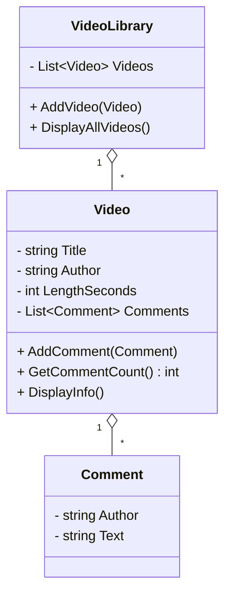
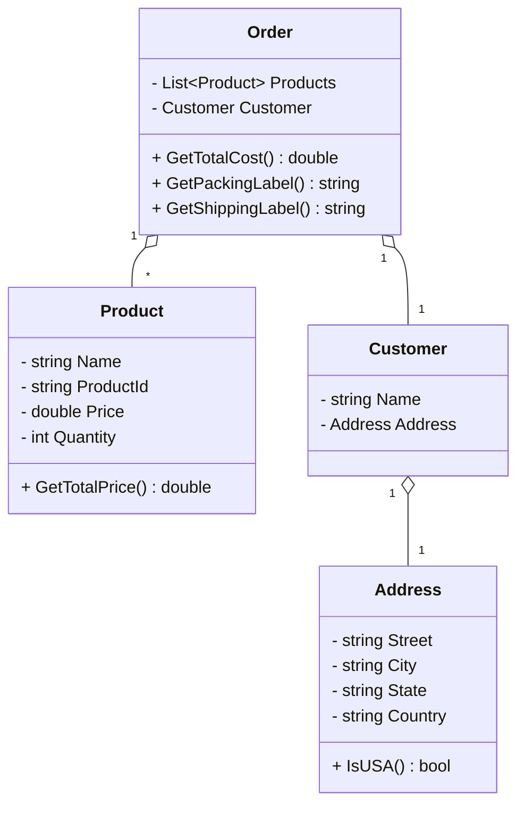

# Class Diagrams for Foundation Programs

## Program 1: Abstraction with YouTube Videos

```mermaid
classDiagram
    class Video {
        - string Title
        - string Author
        - int LengthSeconds
        - List~Comment~ Comments
        + AddComment(Comment)
        + GetCommentCount() int
        + DisplayInfo()
    }
    class Comment {
        - string Author
        - string Text
    }
    class VideoLibrary {
        - List~Video~ Videos
        + AddVideo(Video)
        + DisplayAllVideos()
    }
    Video "1" o-- "*" Comment
    VideoLibrary "1" o-- "*" Video
```

---

## Program 2: Encapsulation with Online Ordering

```mermaid
classDiagram
    class Product {
        - string Name
        - string ProductId
        - double Price
        - int Quantity
        + GetTotalPrice() double
    }
    class Address {
        - string Street
        - string City
        - string State
        - string Country
        + IsUSA() bool
    }
    class Customer {
        - string Name
        - Address Address
    }
    class Order {
        - List~Product~ Products
        - Customer Customer
        + GetTotalCost() double
        + GetPackingLabel() string
        + GetShippingLabel() string
    }
    Customer "1" o-- "1" Address
    Order "1" o-- "*" Product
    Order "1" o-- "1" Customer
```
